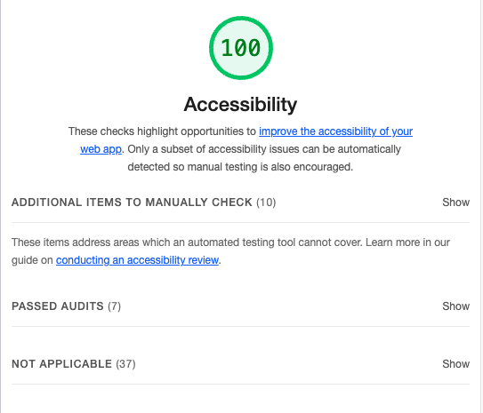

# LAB - 02

## Project Name: About Me

Aloha! I invite you to learn more about me through a fun guessing game.  I will ask you a series of 5 simple questions.  See if you can figure out the answers.  I look forward to our interaction together!

## Author: Jennifer Dotson

## Lab 02

## Links and Resources

- [I followed along this README-template](https://codefellows.github.io/code-201-guide/curriculum/class-02/README-template.html)

- [Here's an explanation of README that I also found helpful](https://gist.github.com/jxson/1784669)

## Lighthouse Accessibility Report

## Reflections and Comments

- How did this go, overall? This was a lot of information to learn in just one day, so I feel overwhelmed.

- What observations or questions do you have about what you’ve learned so far? I enjoy the ability to follow code along with the instructor during lecture.

- How long did it take you to complete this assignment? And, before you started, how long did you think it would take you to complete this assignment? It took me a few hours to complete the assignment using the 15 minute rule and stepping away when I felt stuck.  Before I started, I figured it would take me a few hours and it definitely took longer than I expected.